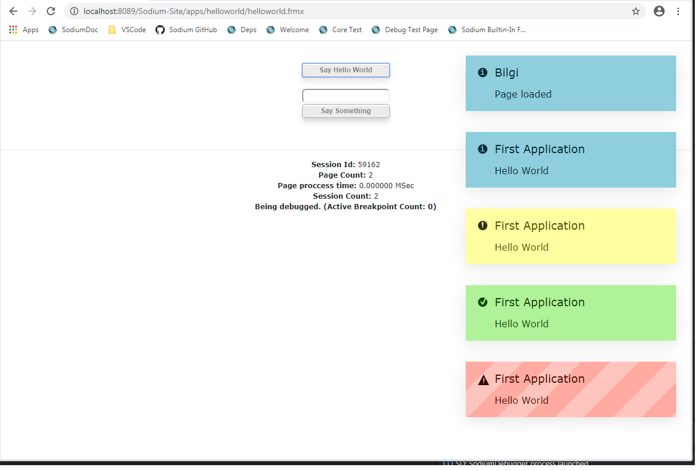

# Hello World Example

## Step 1: Folder Creation

Create a new sub folder named `HelloWorld` under the `Sodium-Site\apps` folder of the installation path.

## Step 2: Control File

**Controller File:** Create a file named `controller.sqlx`. It will be empty. For more information about [controller file](../../language-reference/program-structure/controller-file.md).

## Step 3: Form File

**Form File:** Create a file named `HelloWorld.frmx` and copy/paste the code block showed below into the file.

```text
<!DOCTYPE html>
  
<html>
    <head>
        <title>Hello World</title>

    </head>
  
    <body>
        
        <br />
        <br />

        <controlblock control-block-name="cbDemo">
            <input name="say_hello_world" type="button" value="Say Hello World" style="display: block; margin-left: auto; margin-right: auto; width: 150px;"/>
            <br/>
            <input name="something" type="text" style="display: block; margin-left: auto; margin-right: auto; width: 150px;"/>
            <input name="say_something" type="button" value="Say Something" style="display: block; margin-left: auto; margin-right: auto; width: 150px;"/>
        </controlblock>
  
    </body>
</html>
```

**Form File Explanation:**

* It is a plain html file. The only difference is a `controlblock` tag on the lines between 14 and 19 with a name `control-block-name="cbDemo"`. For more information on control blocks, please follow the link [Control Block](https://sodium.gitbook.io/sodium/language-reference/html-tags/sodium-tags/control-block).
* There is nothing special about the input tag in the control block. For more information on buttons, please follow the link [Button Item](https://sodium.gitbook.io/sodium/language-reference/html-tags/html-tags/inputs/button-item).

## **Step 4: Code Behind File**

**Code behind File:** Create a file named `HelloWorld.sqlx` and copy/paste the code block showed below into the file.

```text
void page.load() {
    message('Page loaded');
}

void cbDemo.say_hello_world() {
    message('First Application', 'Hello World', 'info');
    message('First Application', 'Hello World', 'notice');
    message('First Application', 'Hello World', 'success');
    message('First Application', 'Hello World', 'error');
}

void cbDemo.say_something() {
    message('Say', :cbDemo.something, 'error');
}
```

**Code behind Explanation:**

* Each form file must have a code behind file in the same directory. Code behind files has the same name but with `sqlx` extension. For more information on Code Behind files, please follow the link [Code Behind File](https://sodium.gitbook.io/sodium/language-reference/program-structure/code-behind-file).
* In the ["page\_load" trigger](https://sodium.gitbook.io/sodium/language-reference/built-in-triggers/page-level-triggers/page_load-trigger), [message](hello-world-example.md) function is used in order to show a message on the client browser.

## **Output**

**I**n order to open page, write the form file path into the address bar of the Internet browser \([http://localhost:8089/Sodium-Site/apps/helloworld/helloworld.frmx](http://localhost:8089/Sodium-Site/apps/helloworld/helloworld.frmx)\). After each file request, "Page loaded" will be shown. After click on "Say Hello World" button, "Hello World" message will be shown on four times with different style.



