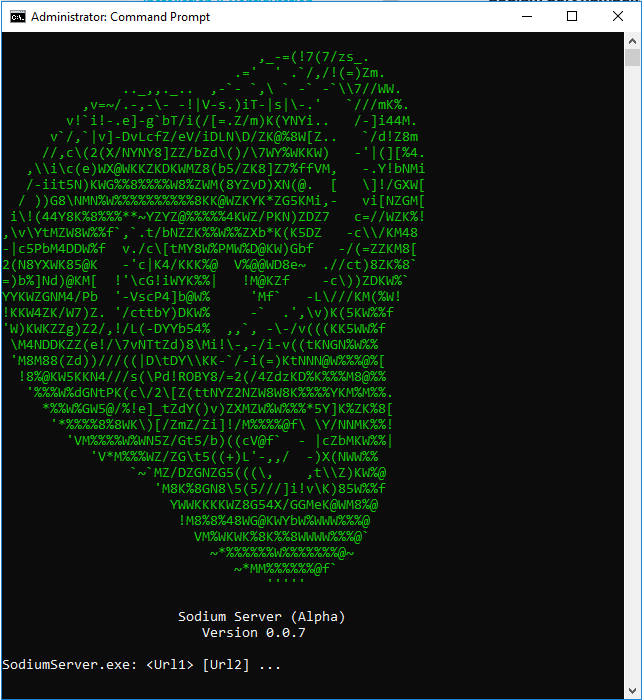

# Installation & Configuration

## Installation Notes

---

## Installation Steps

### 1. Download and Install "_Microsoft Visual C++ 2015 Redistributable Package \(x64\)_" if not already installed. If you have already, skip this step.

Sodium is developed with C language. This package is needed to run C application.





### 2.  Download Sodium package

Download package is nightly built versions of Sodium. Do not try it on live/production database and web servers.

Please report errors/problems you encounter to the following contact points:

Developer E-Mail: [muradkarakas@gmail.com](https://muradkarakas.github.io/Sodium-Manual/download_page.html#) 

LinkedIn Profile Page: [http://tr.linkedin.com/in/muradkarakas](http://tr.linkedin.com/in/muradkarakas)



Youtube playlist for installation \(2 videos\)



### 3. [If you are a developer, follow the instruction on Development page](development/ide.md)

## Prerequisites

<table>
  <thead>
    <tr>
      <th style="text-align:left"><b>Category</b>
      </th>
      <th style="text-align:left"> <b>Software</b>
      </th>
      <th style="text-align:left"> <b>Tested on</b>
      </th>
    </tr>
  </thead>
  <tbody>
    <tr>
      <td style="text-align:left">Operation System</td>
      <td style="text-align:left">MS Windows 64 Bit</td>
      <td style="text-align:left">
        
Windows Server 2012 64Bit

        
Windows 10 64Bit

        
Windows 7 Professional 64Bit

      </td>
    </tr>
    <tr>
      <td style="text-align:left">Database Server</td>
      <td style="text-align:left">
        
Oracle

        
PostgreSQL

        
MySql

        
<b>(See Note No.1)</b>
        

      </td>
      <td style="text-align:left">
        
Oracle Database 18.4 Express Edition 64 Bit

        
PostgreSQL-12.2.1

        
MySql

      </td>
    </tr>
    <tr>
      <td style="text-align:left">Internet Browser</td>
      <td style="text-align:left">
        
Mozilla Firefox

        
Google Chrome

        
Microsoft Internet Explorer Opera

      </td>
      <td style="text-align:left">Latest Versions</td>
    </tr>
    <tr>
      <td style="text-align:left">System Resource (Port)</td>
      <td style="text-align:left">&#x200B;</td>
      <td style="text-align:left">
        
Installation script installs Sodium on port 8089 by default.

        
If this port is used by another application, please find and open StartSodiumServer.bat
          file, modify port parameter and save it.

      </td>
    </tr>
  </tbody>
</table>
1. **For ORACLE:**  
   Check the path of the "oci.dll" file is exists in the system environment variable `PATH`. If not, please add.  
   Setting character encoding to UTF8 on the web server is required for Oracle. Otherwise, characters read from database cannot be seen as expected on the client browser. Please set character encoding part of the NLS\_LANG value to UTF8 on web server. \(Ex: TURKISH\_TURKEY.UTF8\).  
    **For POSTGRESQL:**  
   Check the path of the "libpq.dll" file is exists in the system environment variable `PATH`. If not, please add. 

   **For MySql:**

   Check the path of the "libmysql.dll" file is exists in the system environment variable `PATH`. If not, please add.

   Check the "bin" folder in the MySql installation directory is exists in the system environment variable `PATH`. If not, please add.

2. Do not use space character in installation path. Use only ANSI characters in installation path.


## Troubleshooting

#### If you see that dialog window below when you start `SodiumServer.exe`, click "Yes" since Sodium requires Administrator privilege.

#### If you need to change port number, find and open "StartSodiumServer.bat" file, find the `http://*:8089/` text and modify the number.

#### If you get `"HttpAddUrl failed with 183"` message after you run `SodiumServer.exe`, this means the port number Sodium uses is already in use by another application or another copy of SodiumServer.exe. You can modify the content of "StartSodiumServer.bat" file to change Sodium port number. 

#### If you get "SodiiumServer.exe &lt;Url1&gt; \[Url2\] ..." message after you run SodiumServer.exe, this means that you do not provide required command line parameters. Please have a look at the original "StartSodiumServer.bat" file content to learn usage of SodiumServer.exe. It is advised to run StartSodiumServer.bat file to run Sodium.

#### If `SodiumServer.exe` stop running, it may print out one of the well-known exit codes listed below;

* **Exit code 101:** `SodiumShared.dll` nor found or not accessible.

  **Possible Solutions:**

  * Add `SodiumShared.dll` file path to environment path.
  * Check file permission settings.

* **Exit code 102:** function is not found in `SodiumShared.dll`

  **Solution:** add `SodiumShared.dll` file path to environment path.

* **Exit code 103:** MySql C client library couldn't initialized. Possible reasons;

  * `libmysql.dll` is not found or not accessible
  * One of the functions required to run Sodium is not found in `libmysql.dll` file.
  * MySql client library version is not compatible.

  **Possible Solutions:** 

  * Add `libmysql.dll` file path to environment path.
  * Check file permission settings.

