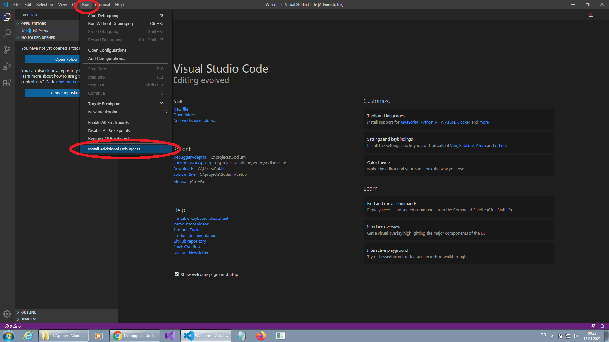
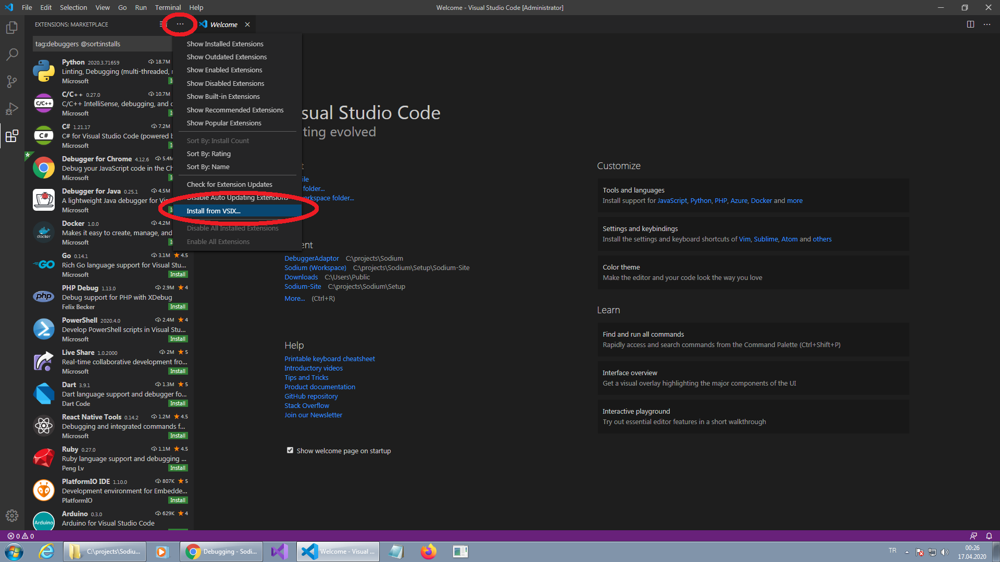
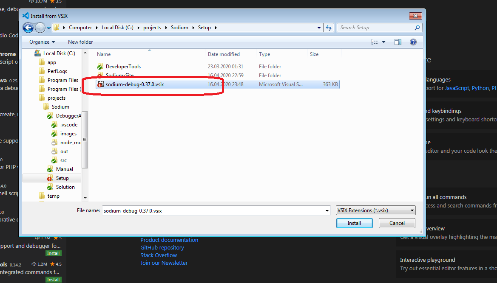
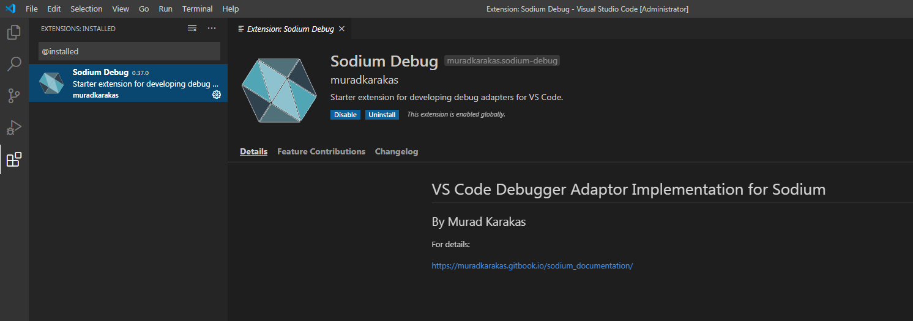
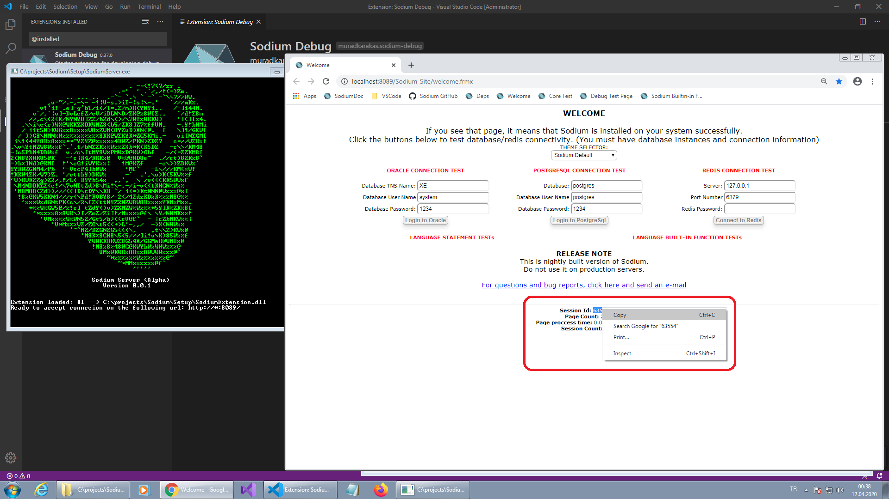
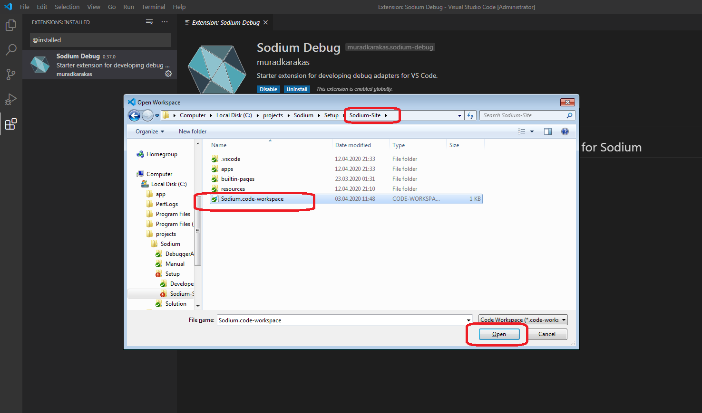
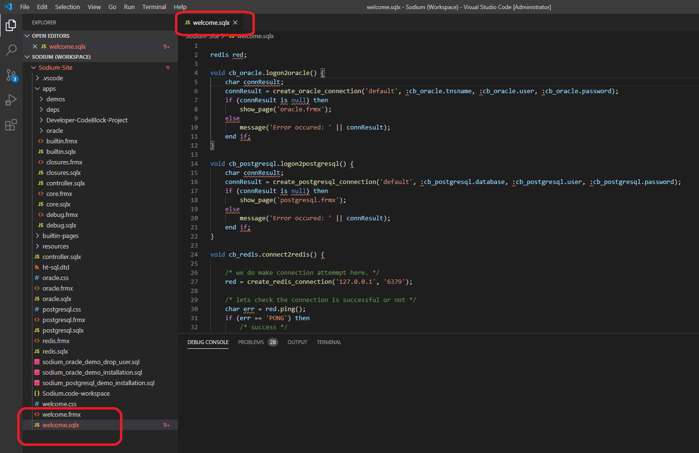
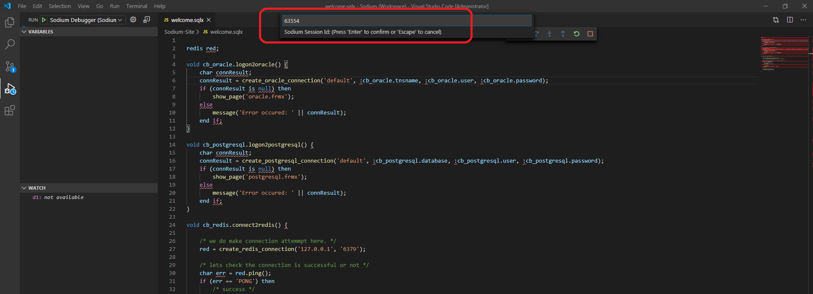
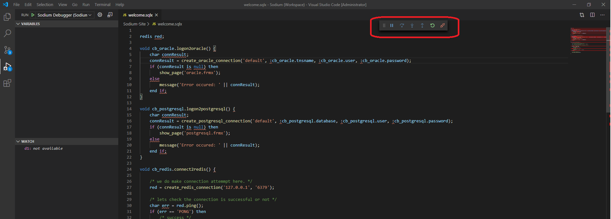

# Debugging

Sodium comes with

* A native 64bit Windows Debugger application, **SodiumDebugger.exe \(SD\)**
* VS Code Debug Adaptor Protocol implementation.

 If you are a Sodium developer and want to debug your Sodium application, follow the steps below:

* Download and Install Visul Studio Code from [https://code.visualstudio.com/download](https://code.visualstudio.com/download)
* Run Visual Studio Code as administrator
* Find and click "Run \ Install Additional Debugger" menu item

* Click "..." button to open pull-down menu and click "Install from VSIX..." item

* Find and click "sodium-debug-x.x.x.vsix" file and click "Install" button

* After installation, you will see the screen below;

Now, Sodium applications can be debugged using Visual Stuido Code editor. In order to check if debugging is working properly, follow the steps below;

* Run **StartSodiumServer.bat** file as administrator
* Wait for internet browser to open and then find the "Session Id: XXXXX" section at the bottom of the page and copy the session id.

* Switch to Visual Stuido Code and then click "File \ Open Workspace" menu item
* Find "Sodium-Site" folder in Sodium installation folder and choose "Sodium.code-workspace" file and click "Open" button.

* Find and open the "welcome.sql" file 

* Press F5 button.
* Paste "session id" into the input box and press "enter" key as shown below;

* SodiumDebugger will be activated 

* Find `cb_oracle.logon2oracle()` function in the welcome.sql file and put a breakpoint on any line in that function.

